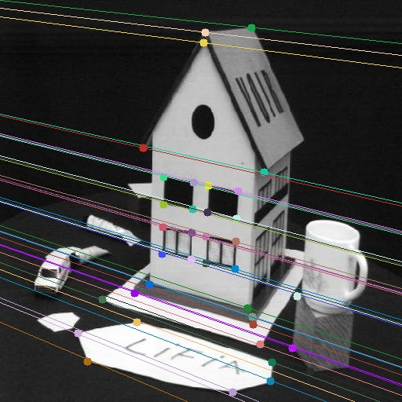
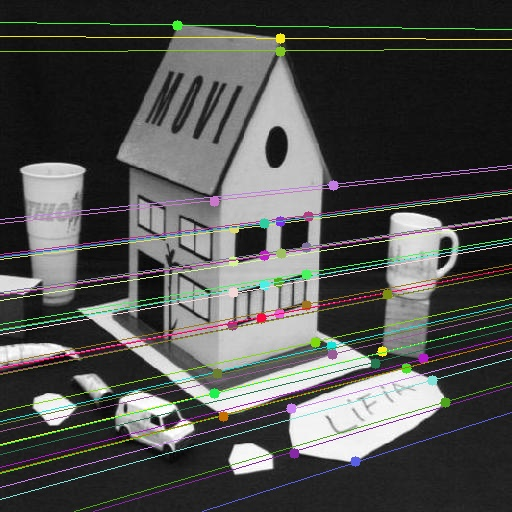
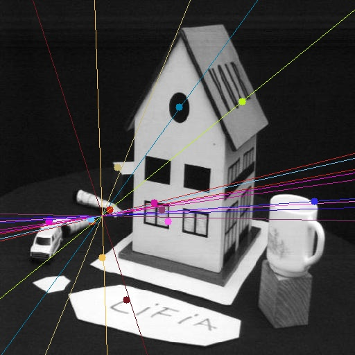
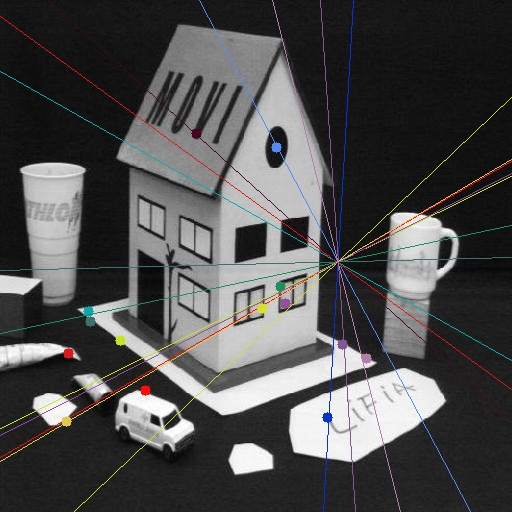

# Epipolar Geometry & 8-Point Algorithm Project

## Introduction
This project focuses on estimating the fundamental matrix using the 8-Point Algorithm, a key concept in computer vision for uncalibrated cameras. We employ epipolar geometry techniques to understand and apply this algorithm.

## Repository Structure
- `epipolar_geometry.ipynb`: Jupyter Notebook containing the main implementation and demonstration.
- `utils.py`: Python script with utility functions for the project.
- `images/`: Directory with images used in the project.
- `requirements.txt`: List of Python dependencies.

## Setup
1. Clone the repository.
2. Install dependencies:
```bash
pip install -r requirements.txt
```
3. Start Jupyter Notebook:
```bash
jupyter notebook epipolar_geometry.ipynb
```

## Project Description
The project is divided into key stages:
1. **Normalized 8-Point Algorithm**: Implementing the algorithm with focus on data conditioning, linear estimation, and rank-2 condition enforcement.
2. **Fundamental Matrix Estimation Tests**: Validating the algorithm with true correspondences and estimating error.
3. **Performance Analysis with Noise**: Analyzing the effect of noise on estimation accuracy.

## Usage
Go through the `epipolar_geometry.ipynb` notebook for a detailed implementation and results. The `utils.py` file contains helper functions used across the project.

## Results
The final section of the notebook presents the results of fundamental matrix estimation, demonstrating the effectiveness of the 8-Point Algorithm in epipolar geometry.

First we will see the results for the given correspondances:


*Epilines for the left image*


*Epilines for the right image*

Using SIFT detectors:


*Epilines for the left image*


*Epilines for the right image*

## Dependencies
- OpenCV
- Numpy
- Matplotlib
- (others in `requirements.txt`)

## License
[MIT License](LICENSE.md)

## Acknowledgments
Special thanks to Prof. Renato Martins for providing the guidelines and resources for this project.
